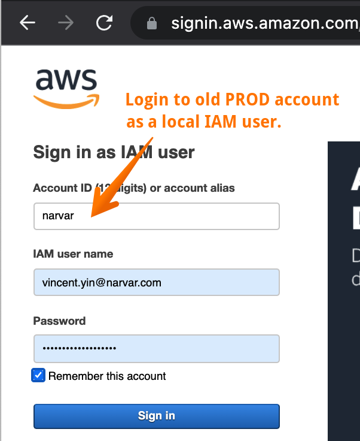
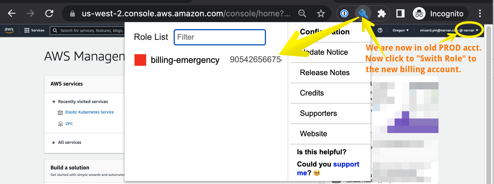
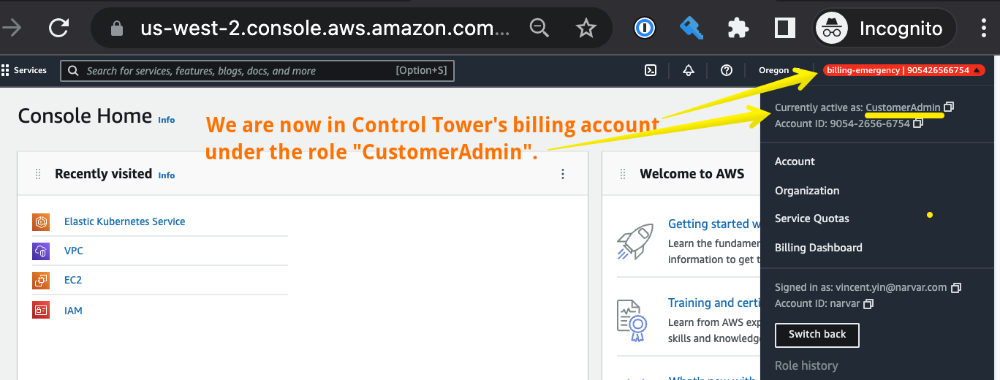
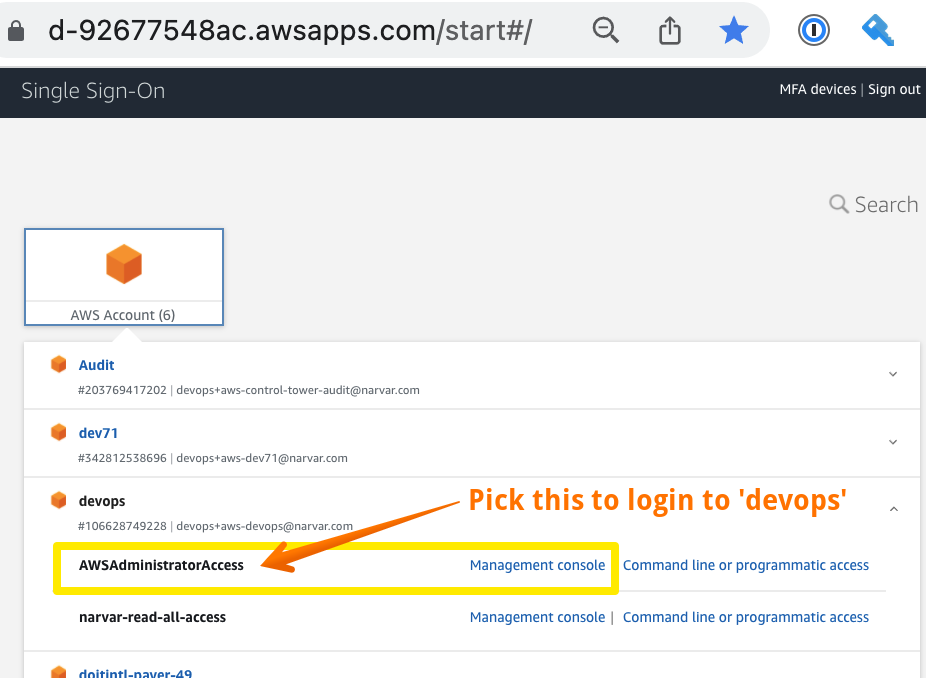
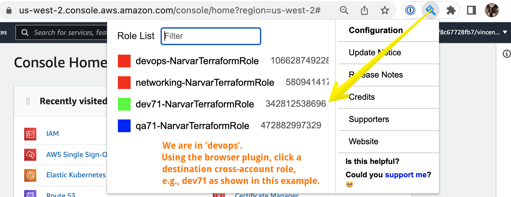
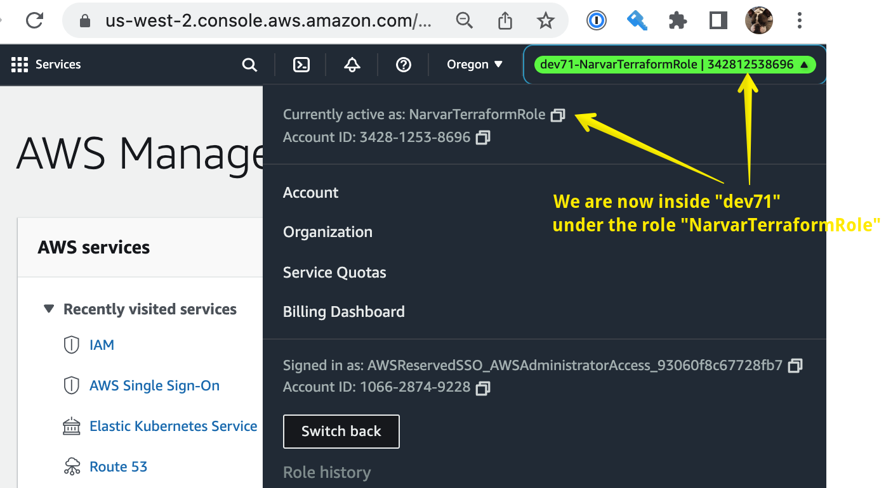
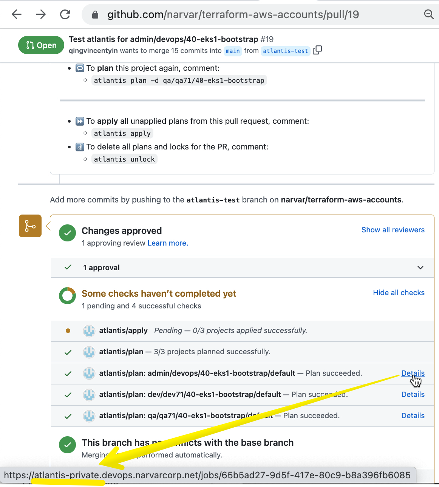
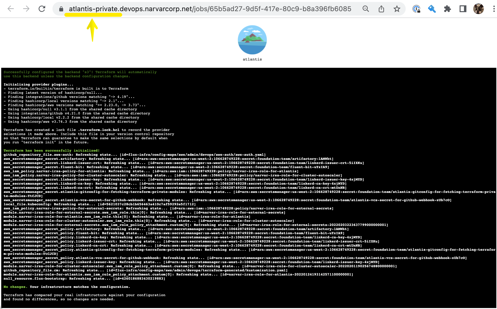
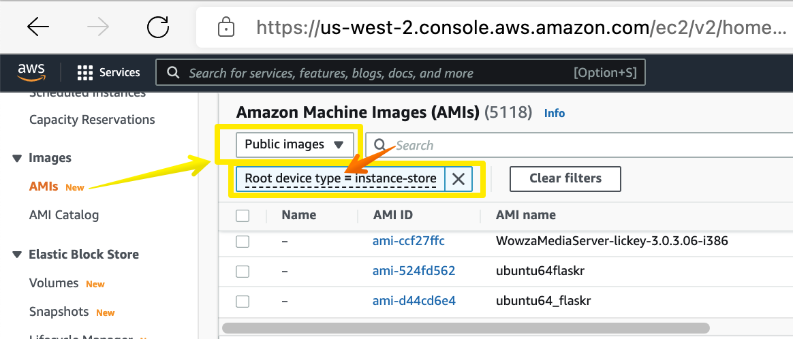
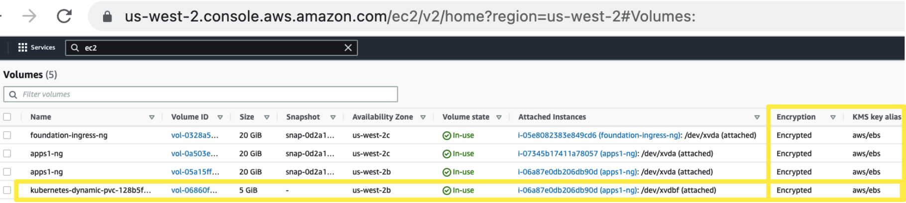

# terraform-aws-accounts <!-- omit in toc -->

<!-- The TOC and section numberings are generated by VS Code extension "Markdown All in One" -->
- [1. Introduction](#1-introduction)
  - [1.1. Onboarding](#11-onboarding)
  - [1.2. Emergency Logins](#12-emergency-logins)
    - [1.2.1. Why We Need Emergency Logins](#121-why-we-need-emergency-logins)
    - [1.2.2. Install Browser Plugin: `aws-extend-switch-roles`](#122-install-browser-plugin-aws-extend-switch-roles)
    - [1.2.3. Type A: Emergency Login to Control Tower's Billing Account](#123-type-a-emergency-login-to-control-towers-billing-account)
    - [1.2.4. Type B: Emergency Login to Assume `NarvarTerraformRole`](#124-type-b-emergency-login-to-assume-narvarterraformrole)
- [2. Set up Your Laptop](#2-set-up-your-laptop)
- [3. Folder Structure and Conventions](#3-folder-structure-and-conventions)
  - [3.1. Terraform Folder Structure](#31-terraform-folder-structure)
  - [3.2. Sequence of Terraform Execution](#32-sequence-of-terraform-execution)
    - [3.2.1. Rule of Thumb Sequence of Folders for `terraform apply`](#321-rule-of-thumb-sequence-of-folders-for-terraform-apply)
    - [3.2.2. Example of Command Sequence for Recreating an EKS Cluster](#322-example-of-command-sequence-for-recreating-an-eks-cluster)
- [4. Atlantis](#4-atlantis)
  - [4.1. Where is Atlantis](#41-where-is-atlantis)
  - [4.2. Github Permissions](#42-github-permissions)
  - [4.3. Github Webhook for Atlantis](#43-github-webhook-for-atlantis)
  - [4.4. Private Ingress for `Details` Button on Github PR Page to Point to Atlantis](#44-private-ingress-for-details-button-on-github-pr-page-to-point-to-atlantis)
  - [4.5. Other Security Considerations for Atlantis](#45-other-security-considerations-for-atlantis)
    - [4.5.1. Helm Variable `service.loadBalancerSourceRanges`](#451-helm-variable-serviceloadbalancersourceranges)
    - [4.5.2. Username/Password for Atlantis](#452-usernamepassword-for-atlantis)
- [5. Encryption](#5-encryption)
  - [5.1. Encryption for Data at Rest](#51-encryption-for-data-at-rest)
    - [5.1.1. Encryption for AWS EBS Volume](#511-encryption-for-aws-ebs-volume)
      - [5.1.1.1. Turn On Region-wide EBS Encryption Flag](#5111-turn-on-region-wide-ebs-encryption-flag)
      - [5.1.1.2. A Primer on AMI: EBS-backed vs. Instance Store-backed](#5112-a-primer-on-ami-ebs-backed-vs-instance-store-backed)
    - [5.1.2. Encryption for Kubernetes `kind: PersistentVolume`](#512-encryption-for-kubernetes-kind-persistentvolume)
  - [5.2. Encryption for Data in Transit](#52-encryption-for-data-in-transit)
  - [5.3. Encryption for Data in Memory](#53-encryption-for-data-in-memory)
- [6. EKS](#6-eks)
  - [6.1. Network Connectivity to EKS Cluster](#61-network-connectivity-to-eks-cluster)


# 1. Introduction

## 1.1. Onboarding

Start with the onboarding info:
  * https://docs.google.com/document/d/1m2CcnYXNGl4wMMMEuz58ej3oUgMnQsLnJ1RuQbWwGmc/edit#heading=h.r4gwnvvdizsb

And, read each subfolder's README in this repo.

## 1.2. Emergency Logins

### 1.2.1. Why We Need Emergency Logins

The above onboarding info and this README as well as READMEs in subfolders generally assume that we'd normally login (either AWS Admin Console or AWS CLI) via the AWS SSO Service.

There are scenarios where the normal login breaks down or is insufficient, as explained in the next few sections.

### 1.2.2. Install Browser Plugin: `aws-extend-switch-roles`

Install this browser plugin:
  * https://github.com/tilfinltd/aws-extend-switch-roles

Copy this:

```ini
#####################################################################
# Type A: Emergency login to Control Tower's billing acct.
#
# Instruction:
# Login to the base account (i.e., the old prod01) first,
# then "Switch Role" to the target account.
#####################################################################

[prod01-base]
# This is the base account from which we "Switch Role" to target acct.
# If this account is aliased in AWS, must use the alias rather than acct#.
aws_account_id = narvar

[billing-emergency]
# This is a target acct (based on the 'source_profile')
role_arn = arn:aws:iam::905426566754:role/CustomerAdmin
source_profile = prod01-base
color = ff0000


#####################################################################
# Type B: Emergency login to Assume 'NarvarTerraformRole'
#
# Instruction:
# AWS SSO login (https://d-92677548ac.awsapps.com/start#/)
# to 'devops' (the base account) under the 'AWSAdministratorAccess'.
# Then, "Switch Role" to any of the target accounts.
#
# After "Switch Role", you'll be under NarvarTerraformRole in the
# target account.
#
# The reason for switching you to that role is that all
# terraform-created AWS resources were created under that role.
# Now, certain types of AWS resources (e.g., EKS clsuter,
# and AWS Service Catalog) initially (by default)
# only permits access from the IAM identity (user or role) that
# created it. So, in case you need to read/update/delete that resource
# manually (outside of terraform) in a trouble-shooting situation,
# you can use this emergency login.
#####################################################################

[devops-base]
# This is the base account from which we "assume role" to target acct.
# If this account is aliased in AWS, must use the alias rather than acct#.
aws_account_id = 106628749228

[devops-NarvarTerraformRole]
# This is a target acct (based on the 'source_profile')
role_arn = arn:aws:iam::106628749228:role/NarvarTerraformRole
source_profile = devops-base
color = ff0000

[networking-NarvarTerraformRole]
role_arn = arn:aws:iam::580941417126:role/NarvarTerraformRole
source_profile = devops-base
color = ff0000

[dev71-NarvarTerraformRole]
role_arn = arn:aws:iam::342812538696:role/NarvarTerraformRole
source_profile = devops-base
color = 00ff00

[qa71-NarvarTerraformRole]
role_arn = arn:aws:iam::472882997329:role/NarvarTerraformRole
source_profile = devops-base
color = 0000ff
```

and paste into the plugin like this:
  

We'll demonstrate how to use this plugin in the next few sections.

### 1.2.3. Type A: Emergency Login to Control Tower's Billing Account

The setup is here:
  * https://github.com/narvar/terraform-aws-control-tower#1-genesis-phase-1-doit-international-creates-the-billing-account

**Note: If your IAM User ID (usually coinciding with your email address) isn't on the IAM Trust Policy as shown in the screenshot in the above URL, go to the billing account and add yourself to it. Do it now. Don't wait after an emergency happens to find out that your user ID is not on the list.**

In this type of emergency, we suppose:

  * Federated AWS SSO (with G Suite) is down. This can be an AWS service outage, G Suite outage, or our own misconfig (e.g., someone in Narvar erroneously modified the config in AWS or G Suite), etc. Regardless of the cause, we find outselves no longer able to login via AWS SSO.

The following steps illustrate how to do emergency login in this case. Note that these steps only work for the billing account (for the new architecture). It doesn't readily login us to child accounts. But once we login to the billing account with full `AdministratorAccess`, we can manually (in emergency) try whatever is necessary to reach child accounts.

Here's how to use it:

  

  

  

### 1.2.4. Type B: Emergency Login to Assume `NarvarTerraformRole`

* **Note:** This isn't on top of Type A login. This is a separate scenario. In case both Type A and B occur at the same time, we'd need to combine both solutions.

In this type of emergency, we suppose:

  * We can successfully login via AWS SSO as we normally do. Now, during active development or trouble-shooting, we may find that our SSO role (even when it has full `AdministratorAccess`) doesn't have sufficient priviledge to read/update/delete some existing AWS resources.

Here's an example of why that may happen. We may find that `kubectl` isn't authorized with any privilege inside the EKS cluster (i.e., not authorized to do `kubectl get pods`, etc.) because, by default, only the **owner** (i.e., the IAM user or role which created the EKS cluster) has `kubectl` access to it. In order to allow other users/roles to access it, an `aws-auth` `ConfigMap` must be set up -- which we do in terraform, but in case our terraform code has a bug or the `ConfigMap` is subsequently corrupted, we'd end up in this emergency.

The *owner* of almost all AWS resources is the `NarvarTerraformRole` in each account (`devops`, `networking`, `dev71`, `qa71`, etc.) That is achieved by having almost all our `providers.tf` look like this:

```hcl
# File: almost every providers.tf

provider "aws" {
  assume_role {
    role_arn = var.narvar_terraform_role_arn
  }
  ...
}
```

So, in this type of emergency, we need to manually `AssumeRole` of `NarvarTerraformRole` (as opposed to staying under a normal SSO role even if that SSO role has full `AdministratorAccess`). The steps are as follows.

  

  

  


# 2. Set up Your Laptop

See:
  - https://github.com/narvar/foundation-local-env


# 3. Folder Structure and Conventions

## 3.1. Terraform Folder Structure

The folder structure in this repo is:

```console
$ tree -d -L 3
.
├── admin
│   ├── devops
│   │   ├── 10-bootstrap
│   │   ├── 20-infra
│   │   ├── 30-eks1
│   │   └── 40-eks1-bootstrap
│   └── networking
│       ├── 10-bootstrap
│       ├── 20-infra
│       └── 40-cross-account-irsa-for-eks
│
├── dev
│   └── dev71
│       ├── 10-bootstrap
│       ├── 20-infra
│       └── 30-eks1
│
├── lab
│   └── lab71
│       └── ...
│
├── prod
│   └── prod71
│       └── ...
│
├── qa
│   └── qa71
│       └── ...
│
└── st
    └── st71
        └── ...
```

* 1st-level folders (e.g., `admin`, `dev`) are named after AWS Organization Units (OU).

* 2nd-level folders (e.g., `devops`, `prod71`) are named after the nicknames of AWS acounts (NOT public AWS [account aliases](https://docs.aws.amazon.com/IAM/latest/UserGuide/console_account-alias.html#AboutAccountAlias)) as displayed in the AWS Admin Console for Control Tower and AWS Organizations. (There doesn't seem to have an official AWS term for this type of names. I call them nicknames.) Some nicknames (e.g., `dev71`, `prod71`) have number suffixes. The suffix (e.g., `71`) are derived by the second octet in the Prod account's CIDR listed in [this IP allocation spreadsheet](https://narvar.atlassian.net/wiki/spaces/devops/pages/122028114/VPC+CIDR). For example, in that spreadsheet, the CIDR `10.71.0.0/16` -- whose second octet is `71` -- is allocated to the account `prod71`.

* 3rd-level folders (e.g., `20-infra`) each represents a different [terraform state](https://learn.hashicorp.com/tutorials/terraform/state-cli). The number prefixes (e.g., `20` as in `20-infra`) represent the coarse grained layers of resources. So, for example, `30-eks1` is a later number than `20-infra`, meaning that the EKS cluster (created in `30-eks1` folder) is created on top of (later than) the VPC (created in `20-infra` folder). Each set of folders at this level generally starts with the folder `10-bootstrap` which is a special case -- it is to be manually run when that AWS account was first created (when the AWS account was prestine/empty.).


## 3.2. Sequence of Terraform Execution

Prerequisite:
  * In order for AWS accounts to exist at the first place, everything needs to be run first in this repo: https://github.com/narvar/terraform-aws-control-tower

### 3.2.1. Rule of Thumb Sequence of Folders for `terraform apply`

Within each 2nd-level folder above (corresponding to AWS accounts), we generally go into each 3rd-level folder in the order of numbered folder names, and run `terraform apply` (whether manually or via Atlantis). For example, within the account folder `devops`, the command `terraform apply` is to be performed in the sequence of the following 3rd-level folders:

```
   ## Under the folder '/admin/devops/':
10-bootstrap
20-infra
30-eks1
40-eks1-bootstrap
```

However, the aggregated sequence of `terraform apply` (when dealing with all AWS accounts as an ecosystem) is somewhat interleaved, and sometimes going back and forth. That's because cross-account resource sharing and references (e.g., cross-account `AssumeRole`, routing table entries, etc.) are often created in a back-and-forth sequence:
  * Create a Transit Gateway in account 1
  * Create a VPC in account 2 plus a Transit Gateway Attachment to 1
  * Go back to account 1 and create a Transit Gateway routing table entry that routes from 1 to 2
  * etc.

There is no universal sequence of execution for such interleaved operations. It needs to be decided on a case-by-case basis. But the following rule-of-thumb ordering should give you a rough idea of the dependency structure we have:

```text
admin/networking/10-bootstrap
admin/networking/20-infra

admin/devops/10-bootstrap
admin/devops/20-infra
admin/devops/30-eks1

Run "aws eks update-kubeconfig --name eks-devops --profile devops"

dev/dev71/10-bootstrap
dev/dev71/20-infra
dev/dev71/30-eks1

Run "aws eks update-kubeconfig --name eks-dev71 --profile dev71"

admin/networking/40-cross-account-irsa-for-eks (needs terraform.tfstate from the above {devops|dev71}/30-eks1 and networking/20-infra)
  ## Trouble-shooting: If the 1st 'terraform apply' gives "Error: Provider produced inconsistent final plan", repeat it.


admin/devops/40-eks1-bootstrap (installs Flux which needs the above networking/40-cross-account-irsa-for-eks)
dev/dev71/40-eks1-bootstrap
```


### 3.2.2. Example of Command Sequence for Recreating an EKS Cluster

For example, if we recreate the EKS cluster `eks-dev71` (by running `terraform destroy` followed by `terraform apply` under the dir `dev/dev71/30-eks1`), then we need to follow that by runing `terraform apply` under both `admin/networking/40-cross-account-irsa-for-eks` and `admin/devops/40-eks1-bootstrap` (among other things) in order to update those resources to point to the newly (re)created `eks-dev71` (which now has a new SSL Certificate Authority and OIDC Provider URL, for example.)

* **Tip:** Terraform v1.x.x seems to have more rigorous comparisons between `terraform.tfstate` and reality. The result is that, after a successful `terraform apply`, a subsequent `terraform plan` often still produces the warning as shown below. If the `-refresh-only` isn't performed to elminate this inconsistency, errors may occur in the future when this `terraform.tfstate` is referenced as a [terraform_remote_state](https://www.terraform.io/language/state/remote-state-data) from another set of terraform code. So, it's a good idea to follow every `terraform apply` with `terraform apply -refresh-only`. When using Atlantis, [our Atlantis uses a Narvar-defined custom workflow](https://github.com/narvar/terraform-aws-accounts/blob/75482f1c376744d678100cfebe1528d57fdd2672/atlantis.yaml#L38-L43) to do this `-refresh-only` for us automatically.

```
$ terraform apply
... # Suppose the execution completes successfully.


  ## We now immediately do a 'terraform plan' to compare.
  ## We'd have thought that it should detect no discrepancy (i.e., an empty plan),
  ## but in fact, it detects discrepancies...
$ terraform plan
...
Terraform detected the following changes made outside of Terraform since the last "terraform apply":
...
Your configuration already matches the changes detected above. If you'd like to update the Terraform state to match, create and apply a refresh-only plan:
  terraform apply -refresh-only
```

So, to properly recreate an EKS cluster (say, `eks-dev71`) and cover all basis, the complete sequence of commands might look like this:

```console
  ## On laptop

  ## See https://github.com/narvar/foundation-local-env#393-typical-workflow-for-accounts-in-the-new-aws-architecture
$ nt
...

  ## Now we're inside the Docker container.
  ## For brevity, we won't display the expanded command prompt such as:
  ##    [Docker](⎈ |eks-devops:default)|devops➜  40-eks1-bootstrap git:(main) ✗ #
  ## We will just display a simple prompt "$" for the commands below.

  ## If haven't done so, set the env like this:
$ sso
$ devops  # Remember: Start from 'devops' no matter which destination AWS account we'll be modifying.

  ## Delete the things on top of eks-dev71 first
$ cd /GITHUB/terraform-aws-accounts/dev/dev71/40-eks1-bootstrap
$ terraform destroy

  ## Delete the eks-dev71 cluster
$ cd ../30-eks1
$ terraform destroy -target module.eks


  ## ........................ Note ...............................................
  ## There are *almost certainly* orphaned resources outside of the EKS cluster
  ## (and out of terraform's control) that you want to (manually) delete now, too.
  ## E.g.,
  ##    - Route 53 records that were created by external-dns
  ##    - AWS Network Load Balancer(s) that was created by ingress controller(s)
  ##    - EBS volumes created by 'kind: PersistentVolume'
  ##
  ## We're not demonstrating how to (manually) delete them here. But if those
  ## are not deleted now (especially stale Route 53), they will make
  ## trouble-shooting very confusing for the subsequently recreated cluster.
  ## Over time, those orphaned resources waste money and become difficult to
  ## distinguish from good/in-use resources.
  ##
  ## CAUTION: When deleting resources via manual ad-hoc commands in AWS CLI
  ##          (e.g., 'aws xxx delete-xxx') and in Kubernetes-related CLI
  ##          (e.g., 'flux uninstall'), make sure to manually switch to
  ##          the target account first via alias like 'dev71'.
  ##          Don't habitually stay under the alias 'devops' env.
  ##          Also, double check first with commands like 'flux get hr -A'
  ##          before deleting it.


  ## Recreate the eks-dev71 cluster.
  ## Reminder: Switch env with alias 'devops' first if haven't done so no matter
  ##           which destination AWS account we'll be modifying.
$ terraform apply

  ## Refresh the state (even though we just did 'terraform apply' -- see "Tip:" above).
$ terraform apply -refresh-only -auto-approve

  ## Re-run other terraform code that reference the above 'terraform_remote_state'
$ cd /GITHUB/terraform-aws-accounts/admin/networking/40-cross-account-irsa-for-eks
$ terraform apply

  ## If the above command produced:
  ##    | Error: Provider produced inconsistent final plan
  ## then repeat it (which may solve the problem):
$ terraform apply

  ## Refresh the state as usual
$ terraform apply -refresh-only -auto-approve


  ## Install Flux, etc., on the newly recreated eks-dev71
$ cd /GITHUB/terraform-aws-accounts/dev/dev71/40-eks1-bootstrap

  ## See README in that folder
$ export TF_VAR_github_user=ravrangitops
$ export TF_VAR_github_token=ghp_******
$ export TF_VAR_github_atlantis_webhook_secret=******

$ terraform apply
$ terraform apply -refresh-only -auto-approve


  ## Update Atlantis (so that it can managed this newly recreated eks-dev71).
  ## Atlantis resides on eks-devops (not eks-dev71).
$ cd /GITHUB/terraform-aws-accounts/admin/devops/40-eks1-bootstrap
$ terraform apply
$ terraform apply -refresh-only -auto-approve

  ## Update ~/.kube/config for the newly recreated EKS cluster.
$ aws eks update-kubeconfig --name eks-dev71 --profile dev71

  ## Switch env
$ dev71
Switched to context "arn:aws:eks:us-west-2:342812538696:cluster/eks-dev71".
Context "arn:aws:eks:us-west-2:342812538696:cluster/eks-dev71" modified.


  ## Now we can run kubectl as usual (toward eks-dev71), e.g.:
$ kubectl get ns


  ## ............................ eks-devops specific steps ................................
  ## Had we *recreated* the central eks-devops (instead of any app cluster such as eks-dev71),
  ## we need to perform the following extra steps.
  ## The central eks-devops has an IRSA role for the Atlantis pod:
  ##    - arn:aws:iam::106628749228:role/narvar-irsa-role-for-atlantis
  ## defined in:
  ##    - terraform-aws-accounts/admin/devops/40-eks1-bootstrap/21-narvar-irsa-role-for-atlantis.tf
  ##
  ## Recreating eks-devops would recreate the IRSA role. The recreated role, although
  ## having the same name/ARN as its previous incarnation, is nevertheless a different IAM identity.
  ## So, all IAM policies that reference this role need to be refreshed like the following.

$ cd /GITHUB/terraform-aws-control-tower/10-bootstrap
$ billing   # For the 10-bootstrap folder, we switch to target account's alias, not 'devops' alias.
$ tf apply  # This will refresh the policy defined in 'iam.tf'.

$ cd /GITHUB/terraform-aws-accounts/admin/networking/10-bootstrap
$ networking
$ tf apply

$ cd /GITHUB/terraform-aws-accounts/dev/dev71/10-bootstrap
$ dev71
$ tf apply

$ cd /GITHUB/terraform-aws-accounts/qa/qa71/10-bootstrap
$ mfaqa     # If haven't done so in the past 24 hours. Remember: It's old alias 'mfaqa' rather than 'sso'.
$ qa71
$ tf apply

... # Repeat for other AWS accounts (lab71, st71, prod71, etc.)

```


# 4. Atlantis

This isn't a step-by-step procedure for setting up [Altantis](https://www.runatlantis.io/); rather, we point out a few things about the setup.

## 4.1. Where is Atlantis

Our Atlantis runs as a Kubernetes pod in our EKS cluster `eks-devops` in the `devops` AWS account.

Most of the setup are done here:

  * https://github.com/narvar/terraform-aws-accounts/tree/main/admin/devops/40-eks1-bootstrap/20-atlantis-secrets.tf
  * https://github.com/narvar/terraform-aws-accounts/tree/main/admin/devops/40-eks1-bootstrap/21-narvar-irsa-role-for-atlantis.tf
  * https://github.com/narvar/flux-infra/blob/master/clusters/aws/admin/devops/apps-deployment/k-atlantis.yaml


## 4.2. Github Permissions

We've set up Atlantis to use the Github user `ravrangitops` (acting as a service account). That user (via [its Github Personal Access Token](https://github.com/narvar/terraform-aws-accounts/blob/main/admin/devops/40-eks1-bootstrap/README.md#13-get-gitbub-token-for-user-ravrangitops)) needs:

  * `Role:Admin` github permission for every repo monitored by Atlantis. The monitoring is done via a Github webhook (per repo) we manually created in Github console and [this webhook secret](https://github.com/narvar/terraform-aws-accounts/blob/main/admin/devops/40-eks1-bootstrap/README.md#14-get-github-webhook-secret-for-atlantis)). This/these repo(s) is/are where our mainline terraform source code is.

  * `Role:Read` github permission for every Narvar private repo which stores the source code for a terraform remote module (not the mainline code). These repos are not monitored by Atlantis, but read by `terraform init`.


For example:

  * [`Role:Admin` on Repo `terraform-aws-accounts`](https://github.com/narvar/terraform-aws-accounts/blob/main/admin/devops/40-eks1-bootstrap/README.md#11-grant-user-ravrangitops-the-roleadmin-on-github-repo-flux-infra). This is where our mainline terraform code is. Upon every PR creation/update, that repo's configured Github webhook sends an HTTP request to our Atlantis pod. The Atlantis pod then initiates the `git clone` of `terraform-aws-accounts`, followed by `terraform init` and `terraform plan`, and eventually (when you enter a PR comment `atlantis apply`) execute `terraform apply` on your behalf.

  * [`Role:Read` on Repo `tf-aws-client-vpn`](https://github.com/narvar/tf-aws-client-vpn/settings/access). This is a Navar proprietary terraform remote module in a private Github repo. It is called by the mainline terraform code above. So, when the Atlantis pod executes `terraform init`, terraform needs to `git clone` from this repo in order to download the module's source code. We've configured Atlantis to cause terraform to use Atlantis' `GITHUB_TOKEN` for this `git clone` operation -- [the trick is here](https://github.com/narvar/terraform-aws-accounts/blob/22333aae525eb800fa473438f31cf25e475dbf5f/admin/devops/40-eks1-bootstrap/files/scripts/create_atlantis_secrets.sh#L86-L95).


## 4.3. Github Webhook for Atlantis

The Github webhook mentioned above works like the following.

The webhook HTTP request is sent from github.com over internet to [our ingress](https://github.com/narvar/flux-infra/blob/master/resources/flux-helm-releases/atlantis/ingress.yaml). The ingress is [deployed in `eks-devops`](https://github.com/narvar/flux-infra/blob/master/clusters/aws/admin/devops/apps-deployment/k-atlantis.yaml). The `ingress` public DNS name is `atlantis.devops.narvarcorp.net` which, via [external-dns](https://github.com/kubernetes-sigs/external-dns), maps to an internet-facing AWS `Network Load Balancer`. The DNS record (`atlantis.devops.narvarcorp.net`) resides in Route53 in a different AWS account, i.e., the `networking` account. The [external-dns in eks-devops](https://github.com/narvar/flux-infra/blob/master/clusters/aws/admin/devops/apps-deployment/k-external-dns.yaml) (in the AWS Account `devops`) assumes a [cross-account IRSA role](https://github.com/narvar/flux-infra/blob/b7c98a90be132f37ad36826e079cd4636ce0d881/resources/flux-helm-releases/external-dns/helmrelease.yaml#L22-L26) to update Route53 hosted in the `networking` account. That IRSA role is [created in the `networking` account](https://github.com/narvar/terraform-aws-accounts/blob/main/admin/networking/40-cross-account-irsa-for-eks/21-narvar-irsa-role-for-external-dns-eks-devops.tf).

We didn't deploy the [AWS Load Balancer Controller](https://docs.aws.amazon.com/eks/latest/userguide/aws-load-balancer-controller.html) for ingress. We deployed the [Kubernetes community nginx controller](https://github.com/narvar/flux-infra/blob/master/clusters/aws/admin/devops/apps-deployment/k-ingress-nginx-public.yaml). That nginx controller [automatically creates an AWS NLB](https://kubernetes.github.io/ingress-nginx/deploy/#aws) for us. The DNS record `atlantis.devops.narvarcorp.net` maps to that NLB as shown below.

```console
  ## HOSTS column maps to an ADDRESS (which is a Route53 Alias Record)
$ kubectl get ingress -A
NAMESPACE   NAME       CLASS                  HOSTS                            ADDRESS
atlantis    atlantis   ingress-nginx-public   atlantis.devops.narvarcorp.net   a37a0e6eae7164b049849cd9a40d9f0a-ad8983f0c242a005.elb.us-west-2.amazonaws.com


$ dig a37a0e6eae7164b049849cd9a40d9f0a-ad8983f0c242a005.elb.us-west-2.amazonaws.com
...
;; ANSWER SECTION:
a37a0e6eae7164b049849cd9a40d9f0a-ad8983f0c242a005.elb.us-west-2.amazonaws.com. 77 IN A 44.241.203.81
a37a0e6eae7164b049849cd9a40d9f0a-ad8983f0c242a005.elb.us-west-2.amazonaws.com. 77 IN A 52.40.180.143
a37a0e6eae7164b049849cd9a40d9f0a-ad8983f0c242a005.elb.us-west-2.amazonaws.com. 77 IN A 44.240.7.222


  ## Same IP addresses in answers compared to above.
$ dig atlantis.devops.narvarcorp.net
...
;; ANSWER SECTION:
atlantis.devops.narvarcorp.net.	51 IN	A	44.241.203.81
atlantis.devops.narvarcorp.net.	51 IN	A	52.40.180.143
atlantis.devops.narvarcorp.net.	51 IN	A	44.240.7.222
```


## 4.4. Private Ingress for `Details` Button on Github PR Page to Point to Atlantis

Atlantis automatically updates the Github PR page with status and `Details` hyperlinks as depicted here:
  

Clicking on that link goes to this page:
  

The DNS resolves to private IP addresses:

```console
$ nslookup atlantis-private.devops.narvarcorp.net
Server:		192.168.0.1
Address:	192.168.0.1#53

Non-authoritative answer:
Name:	atlantis-private.devops.narvarcorp.net
Address: 10.70.65.15
Name:	atlantis-private.devops.narvarcorp.net
Address: 10.70.71.180
Name:	atlantis-private.devops.narvarcorp.net
Address: 10.70.71.93
```

In order for the detail page above (URL `https://atlantis-private.devops.narvarcorp.net/jobs/65b5ad27-9d5f-417e-80c9-b8a396fb6085`) to successfully show up on a brower, we have the following setup:

  1. The hostname portion of that URL (`https://atlantis-private.devops.narvarcorp.net`) is specified in this [helmrelease.yaml](https://github.com/narvar/flux-infra/blob/9d5e77a6bc99fea557119cd9b8dbc9808af1b275/resources/flux-helm-releases/atlantis/helmrelease.yaml#L34). It is provided by [this **private** ingress](https://github.com/narvar/flux-infra/blob/923d70094e0f3ca88719fcaa9fd785ebe011a65a/resources/flux-helm-releases/atlantis/ingress.yaml#L39-L66).
  2. In order for the HTTP traffic from your browser to reach the above private ingress, you need to launch [AWS Client VPN](https://github.com/narvar/terraform-aws-accounts/blob/main/admin/networking/20-infra/README.md) on your laptop first.


## 4.5. Other Security Considerations for Atlantis

Although we haven't implemented them as of March, 2022, the following are some of the additional security measures we can implement (perhaps in the future).

### 4.5.1. Helm Variable `service.loadBalancerSourceRanges`

This variable is somehow missed in the default [values.yaml](https://github.com/runatlantis/helm-charts/blob/5f77096adc480b6cf86762a0535513cfa9ebbbd0/charts/atlantis/values.yaml#L181-L184) that comes with the chart, but it exists in the template file [service.yaml](https://github.com/runatlantis/helm-charts/blob/5f77096adc480b6cf86762a0535513cfa9ebbbd0/charts/atlantis/templates/service.yaml#L12-L15). This var is [explained here](https://kubernetes.io/docs/concepts/services-networking/service/).

We can use this var either instead of or in addition to our current [whitelist-source-range in ingress controller](https://github.com/narvar/flux-infra/blob/923d70094e0f3ca88719fcaa9fd785ebe011a65a/config-maps/aws/admin/devops/ingress-nginx-public/values.yaml#L19-L20).


### 4.5.2. Username/Password for Atlantis

Atlantis can be configured for HTTP Basic Authentication (username/password):

  * https://www.runatlantis.io/docs/security.html#enable-authentication-on-atlantis-web-server


# 5. Encryption

## 5.1. Encryption for Data at Rest
### 5.1.1. Encryption for AWS EBS Volume

#### 5.1.1.1. Turn On Region-wide EBS Encryption Flag

We have turned on the region-wide flag [aws_ebs_encryption_by_default](https://registry.terraform.io/providers/hashicorp/aws/latest/docs/resources/ebs_encryption_by_default) for all EBS volumes to be encrypted by default:

  * [devops/20-infra/05-ebs.tf](https://github.com/narvar/terraform-aws-accounts/blob/main/admin/devops/20-infra/05-ebs.tf)
  * [networking/20-infra/05-ebs.tf](https://github.com/narvar/terraform-aws-accounts/blob/main/admin/networking/20-infra/05-ebs.tf)
  * [dev71/20-infra/05-ebs.tf](https://github.com/narvar/terraform-aws-accounts/blob/main/dev/dev71/20-infra/05-ebs.tf)
  * etc.


#### 5.1.1.2. A Primer on AMI: EBS-backed vs. Instance Store-backed

AWS docs do a poor job in explaining the difference between EBS-backed vs. Instance Store-backed AMIs. But this topic is important in understanding whether an EC2's disks are encrypted or not.

The difference is explained much better in this blog:

  * https://medium.com/awesome-cloud/aws-difference-between-ebs-and-instance-store-f030c4407387


**EBS-backed AMIs** are the most commonly seen AMIs. They include: default Amazon Linux 2 images, default EKS images, and almost all AMIs in the AWS Admin Console when launching an EC2. When launching an EC2 instance from such an AMI, every disk (including the root disk) defined by the image will be created as an EBS volume (newly created for this particular EC2 instance). Because we've turned on `aws_ebs_encryption_by_default`, every such EBS volume is encrypted.

**Instance store-backed AMIs** are rare and are usually for Artificial Intelligence/Machine Learning which needs fast temp storage for lots of ephemeral data. There's no EBS volume at all (root disk or otherwise) for the launched EC2 instance, and therefore isn't covered by this `aws_ebs_encryption_by_default` flag. The EC2 disks are not encrypted in this case. (If you still want encryption, you'd need to install your own OS-level encryption software such as described in [this blog](https://aws.amazon.com/blogs/security/how-to-protect-data-at-rest-with-amazon-ec2-instance-store-encryption/).)

To find out whether a given AMI is EBS-backed or instance store-backed, do this:

```console
$ aws ec2 describe-images --image-ids ami-09a6c71de04f0aa50
{
    "Images": [
        {
            "ImageId": "ami-09a6c71de04f0aa50",
            ...
            "BlockDeviceMappings": [
                {
                    "DeviceName": "/dev/sda1",
                    "Ebs": {                <== This means the AMI is EBS-backed
                        "DeleteOnTermination": true,
                        "SnapshotId": "snap-021b9066f6ec6f67a",
                        "VolumeSize": 100,
                        "VolumeType": "gp2",
                        "Encrypted": false  <== This particular (design time) AMI is unencrypted,
                                                but the (runtime) EC2 disk will be encrypted because
                                                of our "aws_ebs_encryption_by_default" flag discussed above.


$ aws ec2 describe-images --image-ids ami-00bb6f60
{
    "Images": [
        {
            "ImageId": "ami-00bb6f60",
            ...
            "BlockDeviceMappings": [
                {
                    "DeviceName": "sdb",
                    "VirtualName": "ephemeral0"  <== This means the AMI is instance store-backed
                },
                {
                    "DeviceName": "sdc",
                    "VirtualName": "ephemeral1"  <== This means the AMI is instance store-backed
                }
            ],
```

To search AMI by `BlockDeviceMappings`:

  


### 5.1.2. Encryption for Kubernetes `kind: PersistentVolume`
See Also:
  - [parameters: encrypted & kmsKeyId](https://kubernetes.io/docs/concepts/storage/storage-classes/#aws-ebs)


EKS out-of-the-box default `kind: StorageClass` is as follows. It does **NOT** contain the `encrypted: 'true'` flag which would **explicitly** ensure that the underlying EBS volumes are encrypted:

```console
$ kubectl get storageclass gp2 -o yaml | yq e -P -

apiVersion: storage.k8s.io/v1
kind: StorageClass
metadata:
  name: gp2
  ...
parameters:
  fsType: ext4
  type: gp2
  ## encrypted: '...' # <== This out-of-the-box default StorageClass does NOT set this flag.
```

However, in our Narvar setup, it is **implicitly** ensured because we've turn on the region-wide `aws_ebs_encryption_by_default` flag as explained in the previous section. So, the EBS for `PersistentVolume` (using the above default `StorageClass`) will be encrypted after all for Narvar's EKS clusters. An example of such an encrypted EBS (for `PersistentVolume`) can be seen in the AWS Admin Console like this:

  


## 5.2. Encryption for Data in Transit

TODO.


## 5.3. Encryption for Data in Memory

Kubernetes has an `etcd` database running in the master node. It stores all `kind: Secret` objects, among other things. For our setup, we have explicitly [turned on encryption for in-memory copy of the `Secret` stored in `etcd`](https://github.com/narvar/terraform-aws-accounts/blob/645b4ce14784aba52e0bfb7c522ec6388bf60f63/admin/devops/30-eks1/eks.tf#L94-L118).


# 6. EKS
## 6.1. Network Connectivity to EKS Cluster

See:
  * https://github.com/narvar/terraform-aws-accounts/tree/main/admin/devops/30-eks1#3-network-connectivity-aws-client-vpn
