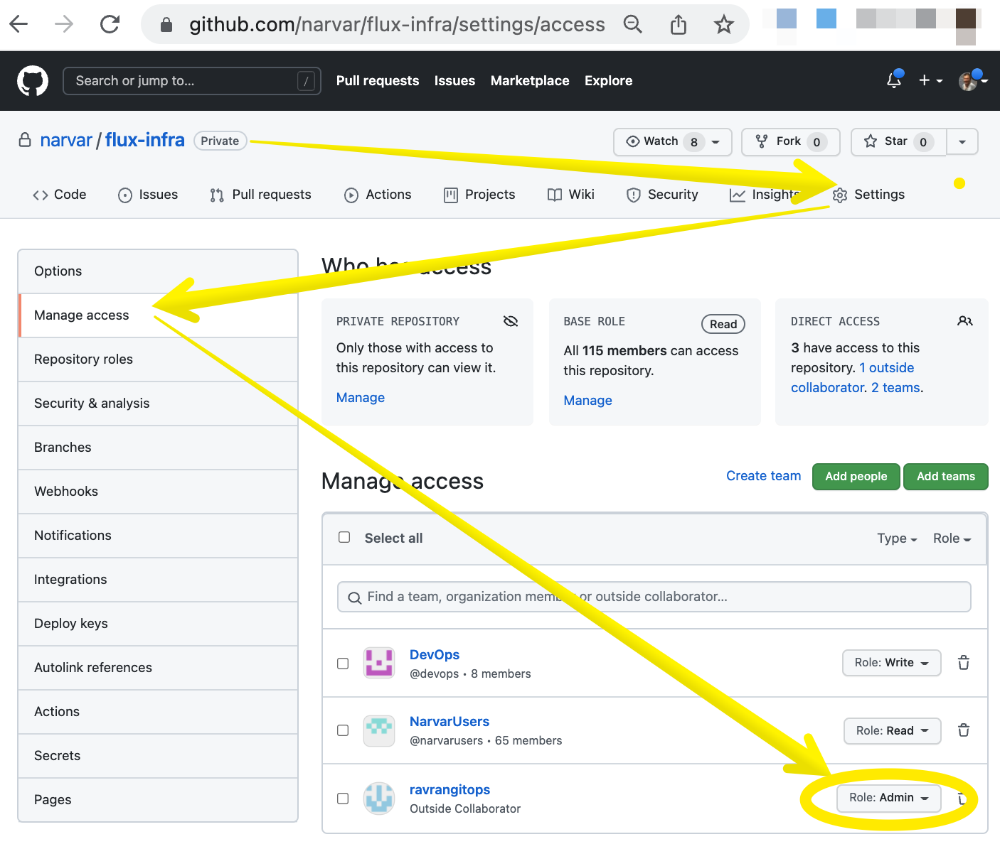
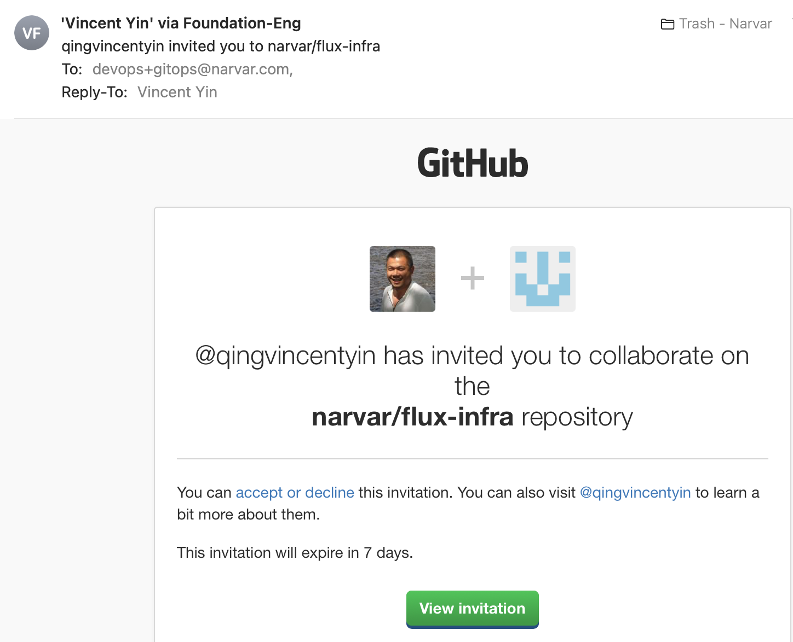
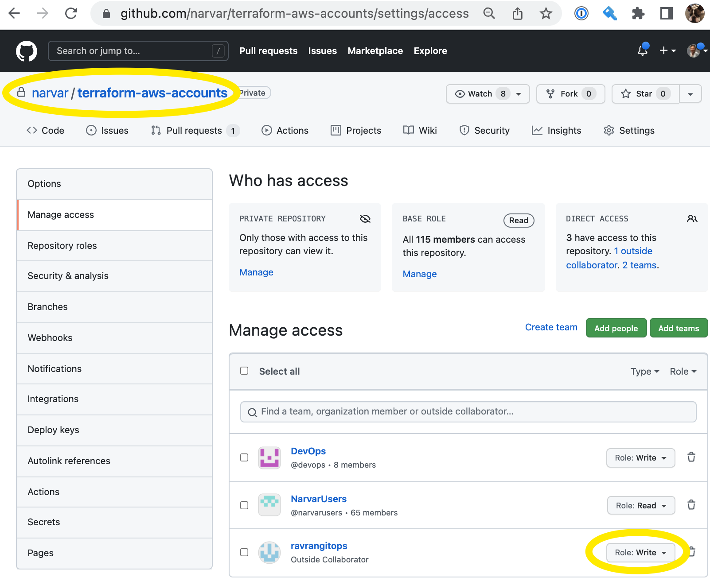
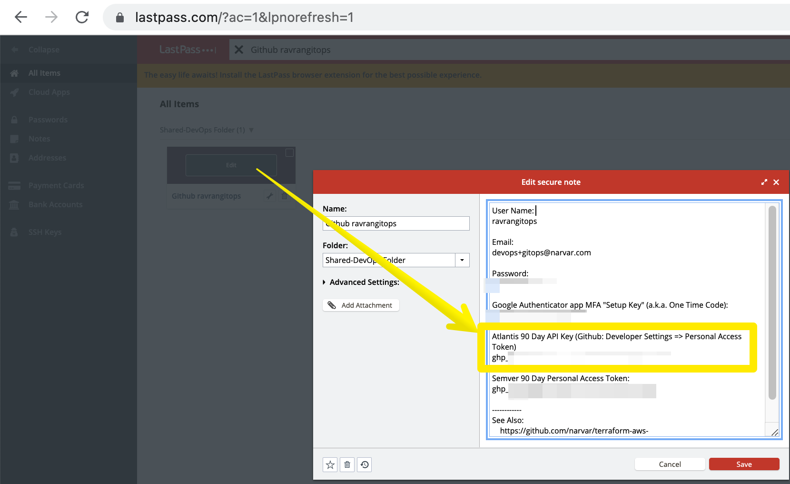
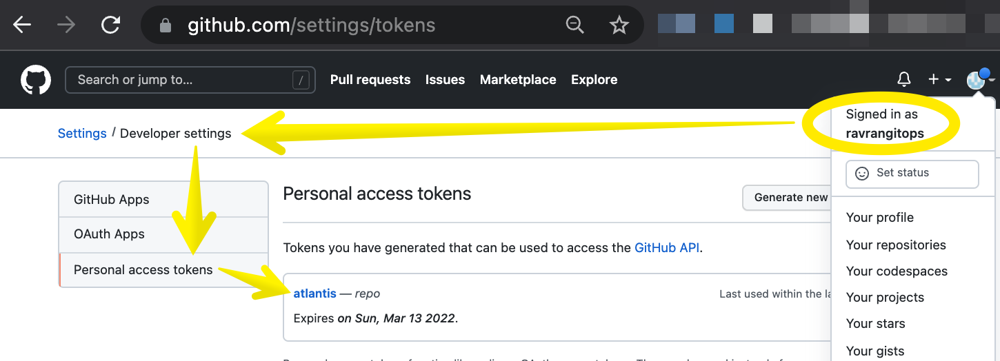
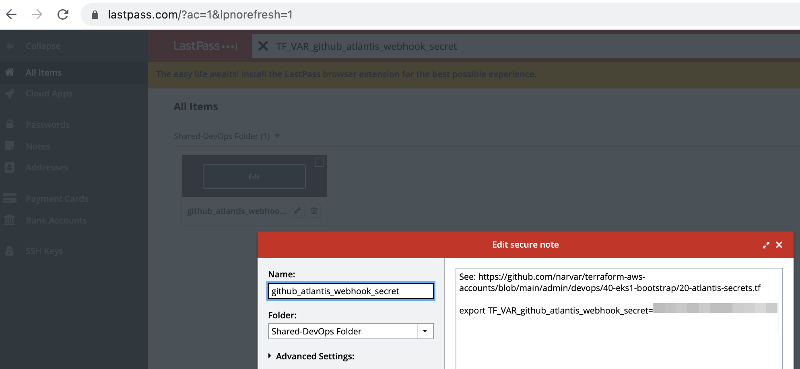
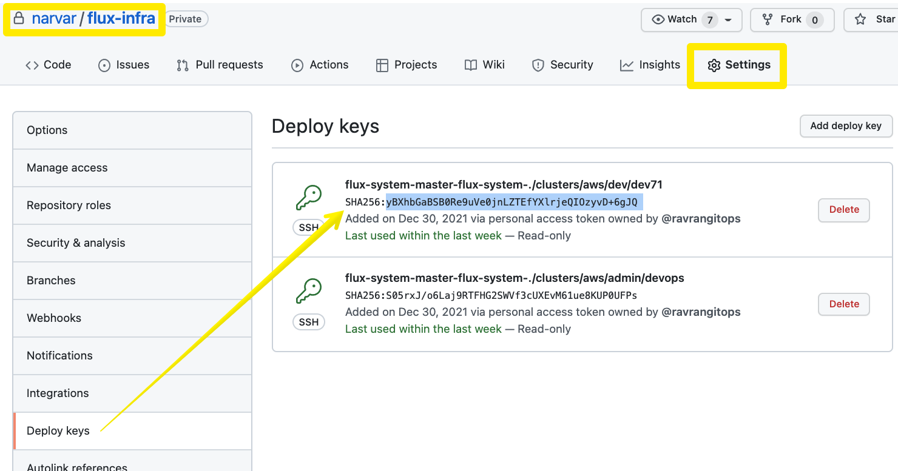

# 40-eks1-bootstrap <!-- omit in toc -->

<!-- The TOC and section numberings are generated by VS Code extension "Markdown All in One" -->
- [1. How to `terraform apply` in This Folder for the *First* Time](#1-how-to-terraform-apply-in-this-folder-for-the-first-time)
  - [1.1. Grant User `ravrangitops` the `Role:Admin` on Github Repo `flux-infra`](#11-grant-user-ravrangitops-the-roleadmin-on-github-repo-flux-infra)
  - [1.2. Grant User `ravrangitops` the `Role:Write` on Github Repo `terraform-aws-accounts`](#12-grant-user-ravrangitops-the-rolewrite-on-github-repo-terraform-aws-accounts)
  - [1.3. Get Gitbub Token for User `ravrangitops`](#13-get-gitbub-token-for-user-ravrangitops)
  - [1.4. Get Github Webhook Secret for Atlantis](#14-get-github-webhook-secret-for-atlantis)
  - [1.5. Assign Secrets to Terraform Input Variables](#15-assign-secrets-to-terraform-input-variables)
  - [1.6. Run Terraform (needs AWS Client VPN)](#16-run-terraform-needs-aws-client-vpn)
- [2. How to `terraform apply` in This Folder for *Subsequent* Times](#2-how-to-terraform-apply-in-this-folder-for-subsequent-times)
- [3. Troubleshootings](#3-troubleshootings)
  - [3.1. Troubleshooting A: Verify the Fingerprint of Github Deploy Key for Flux](#31-troubleshooting-a-verify-the-fingerprint-of-github-deploy-key-for-flux)


# 1. How to `terraform apply` in This Folder for the *First* Time

Atlantis cannot execute the terraform code in this folder for the **first** time of `terraform apply`. We (Foundation DevOps engineers) need to execute this manually.

Reason(s):

  * `10-kubeconfig-file.tf` generates a local file `kubeconfig_eks-***` (on local filesystem) which is tracked by `terraform.tfstate`. This file needs to be committed to Github (manually by an engineer from the laptop.) Atlantis doesn't do `git commit`.

Follow the steps below to manually `terraform apply` for the **first** time.


## 1.1. Grant User `ravrangitops` the `Role:Admin` on Github Repo `flux-infra`

If haven't done so, grant permission in Github like this:



The `Role:Admin` (as opposed to `Role:Write`) permission is needed so that `flux boostrap ...` can run against this repo. Otherwise, we'd get [this problem](https://github.com/fluxcd/source-controller/issues/490#issuecomment-973155143) where the solution is in [the next comment](https://github.com/fluxcd/source-controller/issues/490#issuecomment-973450842).

When granting the permission, Github may automatically send an invitation email to that user like the following (`ravrangitops`'s email address is `devops+gitops@narvar.com` in this screenshot):



If so, you'll then need to manually login to Github website on a browser as the username `ravrangitops` in order to accept the invitation. To get the Github login credential for `ravrangitops`, see the section [Get Gitbub Token for User `ravrangitops`](#13-get-gitbub-token-for-user-ravrangitops).


## 1.2. Grant User `ravrangitops` the `Role:Write` on Github Repo `terraform-aws-accounts`

Do the same for the repo `terraform-aws-accounts`. This is for Atlantis to read from the repo and [set status to the PR](https://github.com/runatlantis/atlantis/issues/928).




## 1.3. Get Gitbub Token for User `ravrangitops`

Get from LastPass the Github token (a.k.a. the API Key) for `ravrangitops`.



* **FYI:** That token was originally generated by this:

  


If you also need to interactively login to Github website as this user, you'll need (also from the above LastPass) the MFA "Setup Key" (a.k.a. "One Time Code") for your Google Authenthenticator app (not Microsoft Authenthenticator app) on your smartphone (i.e., add an MFA on your smartphone's Google Authenticator app by choosing the `Enter a setup key` method rather than the `Scan a QR code` method).


## 1.4. Get Github Webhook Secret for Atlantis

* **Note:** This secret is no longer needed to run terraform. But we preserve this section because you need it to populate AWS Secret Manager.

Get from LastPass the Github webhook secret for Atlantis (`github_atlantis_webhook_secret`):



* **FYI:** That secret was originally generated by this:

  

## 1.5. Assign Secrets to Terraform Input Variables

The terraform code in this folder has a few input variables that are secrets. There are different ways to assign values to terraform variables. We'll demonstrate one way that's suitable for secret values.

Assign secrets in your Linux shell like this:

```bash
export TF_VAR_github_user=ravrangitops       ## Github username for Atlantis and for terraform provider "github"
export TF_VAR_github_token=ghp_************  ## Get this secret from LastPass: "ravrangitops" (screenshot above)
```

## 1.6. Run Terraform (needs AWS Client VPN)

After all the preparations above, we are now able to run terraform:

```console
  ## Activate AWS Client VPN on laptop first.
  ## Then, from laptop (not Atlantis), do:
$ terraform init

$ terraform apply # This generates, among other things, a file named like 'kubeconfig_eks-devops'

$ terraform apply -refresh-only
```

Commit and push the newly generated `kubeconfig_eks-devops` file (or a similar name) to Github `main` branch so that Atlantis can subsequently use it for future PRs.


# 2. How to `terraform apply` in This Folder for *Subsequent* Times

For **subsequent** executions of `terraform apply`, we can either repeat the above manual step or let Atlantis do all the grunt work.

After manually committing and pushing the `kubeconfig_eks-devops` file (or a similar name) to Github as above (for the first time), Atlantis now has everything it needs to automatically run `terraform apply` on our behalf. So, subsequent changes in this folder can be made as a Github PR. Upon submitting the PR, Atlantis will kick in as usual (e.g., generate the plan for review, and the reviewer enter `atlantis apply` into the PR comment, etc.) In this case, we no longer to manually `terraform apply` from our laptop anymore.

In particular, in [this Flux helmrelease.yaml snippet](https://github.com/narvar/flux-infra/blob/a7fe7c31a3148a7d24c96244535c397b5660ccd0/resources/flux-helm-releases/atlantis/helmrelease.yaml#L92-L100), we leverage [this piece of external-secrets](https://github.com/narvar/flux-infra/blob/a7fe7c31a3148a7d24c96244535c397b5660ccd0/resources/external-secrets/foundation-team/atlantis/atlantis-vcs-secret-for-github-webhook/external-secrets.yaml#L23) to fetch the secrets from AWS Secret Manager and populate environment variables for the Atlantis pod which is equivalent to these hypothetical shell commands:

```bash
export TF_VAR_github_user=ravrangitops
export TF_VAR_github_token=ghp_************
```


# 3. Troubleshootings

## 3.1. Troubleshooting A: Verify the Fingerprint of Github Deploy Key for Flux

During `flux bootstrap ...` (executed by [./31-flux-bootstrap.tf](./31-flux-bootstrap.tf)), Flux creates a *Github Deploy Key*. Github console shows the fingerprint of the public key which can be compared to the pub/priv key pair stored in a Kubernetes `kind: Secret` as follows:

```yaml
$ kubectl -n flux-system get secrets flux-system -o yaml

apiVersion: v1
kind: Secret
metadata:
  name:      flux-system
  namespace: flux-system

data:

  # private key (base64 encoded)
  identity:     ...........

  # public  key (base64 encoded)
  identity.pub: ZWNkc2Etc2hhMi1uaXN0cDM4NCBBQUFBRTJWalpITmhMWE5vWVRJdGJtbHpkSEF6T0RRQUFBQUlibWx6ZEhBek9EUUFBQUJoQk9Ia3gxOEwzYWwyWitVeXlwK3U4TFVmVHI5ZGVNbk0xbUJnT01oTCtUNTBaejErbk81aE1ta0QrMVRRUERSQjZEOHVlTXZHWVZKSEkzRG05NU41N3FETmRVR25ZdEVISElVTjhiYkZxbGJOcUJhZm1wcXpqZWdQREVvTmFaV3M5Zz09Cg==

  ...
```

```console
  ## Base64-decode the above public key.
$ echo ZWNkc2Etc2hhMi1uaXN0cDM4NCBBQUFBRTJWalpITmhMWE5vWVRJdGJtbHpkSEF6T0RRQUFBQUlibWx6ZEhBek9EUUFBQUJoQk9Ia3gxOEwzYWwyWitVeXlwK3U4TFVmVHI5ZGVNbk0xbUJnT01oTCtUNTBaejErbk81aE1ta0QrMVRRUERSQjZEOHVlTXZHWVZKSEkzRG05NU41N3FETmRVR25ZdEVISElVTjhiYkZxbGJOcUJhZm1wcXpqZWdQREVvTmFaV3M5Zz09Cg== | base64 -d > /tmp/flux-system.identity.pub


  ## Compute the fingerprint of the public key.
  ## https://gist.github.com/StevenMaude/f054064ede8c9e781ed8#gistcomment-3545105
$ ssh-keygen -E sha256 -l -f /tmp/flux-system.identity.pub
384 SHA256:yBXhbGaBSB0Re9uVe0jnLZTEfYXlrjeQIOzyvD+6gJQ no comment (ECDSA)
```

The above fingerprint should agree with the fingerprint displayed in Github console:

  
