# bootstrap <!-- omit in toc -->

<!-- The TOC and section numberings are generated by VS Code extension "Markdown All in One" -->
- [1. Run Terraform](#1-run-terraform)
- [2. Manually Create a Private Root CA in ACM](#2-manually-create-a-private-root-ca-in-acm)
- [3. Manually Increase the Quota for `Routes per Client VPN endpoint`](#3-manually-increase-the-quota-for-routes-per-client-vpn-endpoint)
- [4. Register a Public DNS Domain in Route 53 Registrar](#4-register-a-public-dns-domain-in-route-53-registrar)

# 1. Run Terraform

If haven't done so, configure your laptop according to the root level [README.md](../../../README.md).

Then, run the terraform in this folder:

```console
  ## Ensure that we're targetting the correct AWS account
$ aws sts get-caller-identity
{
    "UserId": "...",
    "Account": "111122223333",  <== Make sure this is the correct account ID !!!
    "Arn": "arn:aws:sts::111122223333:assumed-role/AWSReservedSSO_AWSAdministratorAccess_xxxxxx/vincent.yin@narvar.com"
}

$ terraform apply
```

# 2. Manually Create a Private Root CA in ACM

As of Nov 2021, there is no fully automated way in terraform to create a private root CA in ACM.
The resource `aws_acmpca_certificate_authority` involves a manual step outside of terraform:

  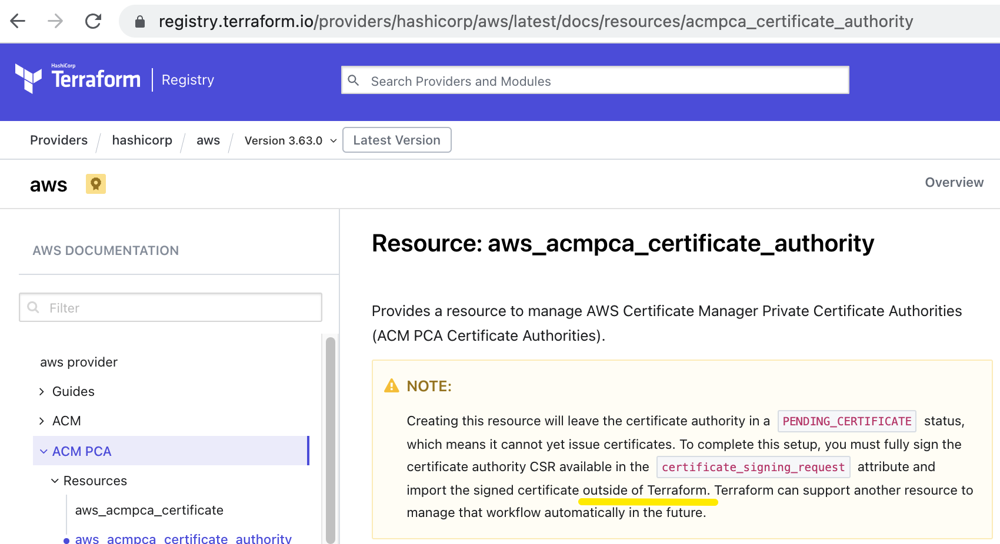

That's quite awkward, hard to follow and automate. It is much easier to just click a few buttons in AWS Admin Console and get it done with. The AWS Admin Console's wizard orchestrates the complex workflow for us (which terraform is unable to orchestrate at this time.)

So, go to AWS Admin Console for this account, and create a private root CA like this:

  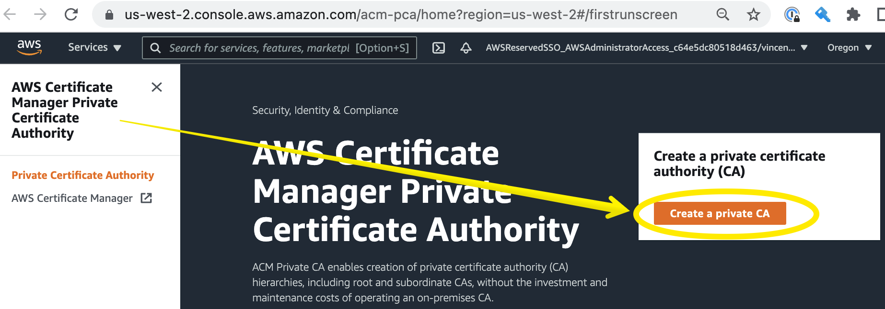
  
  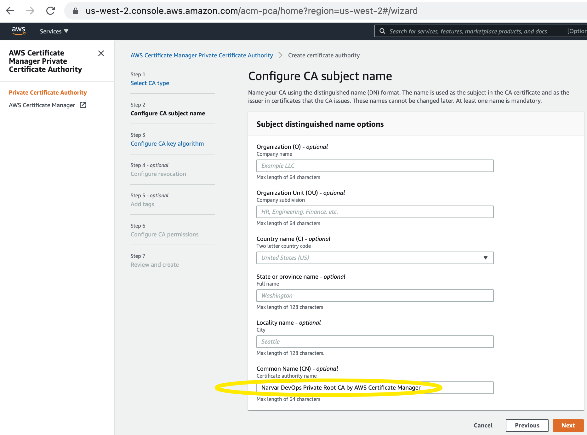
  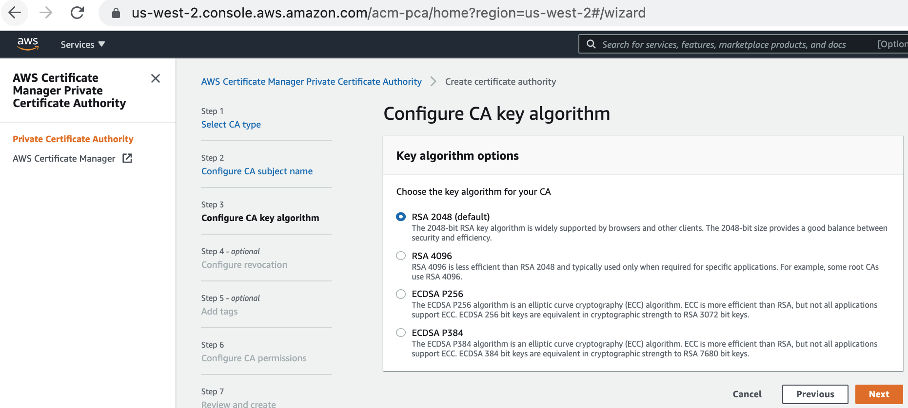
  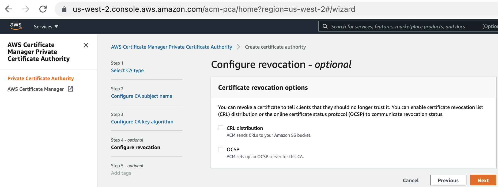
  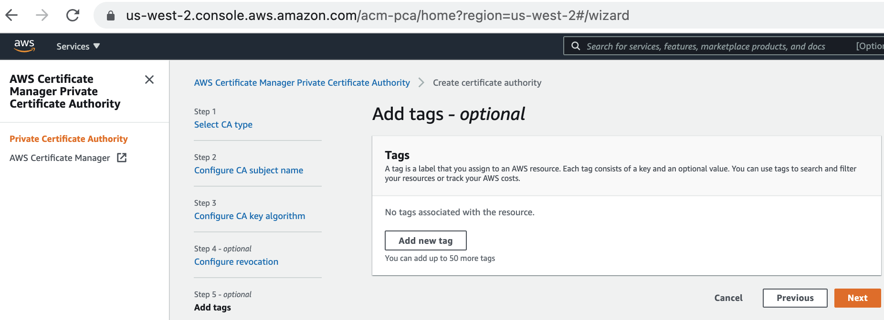
  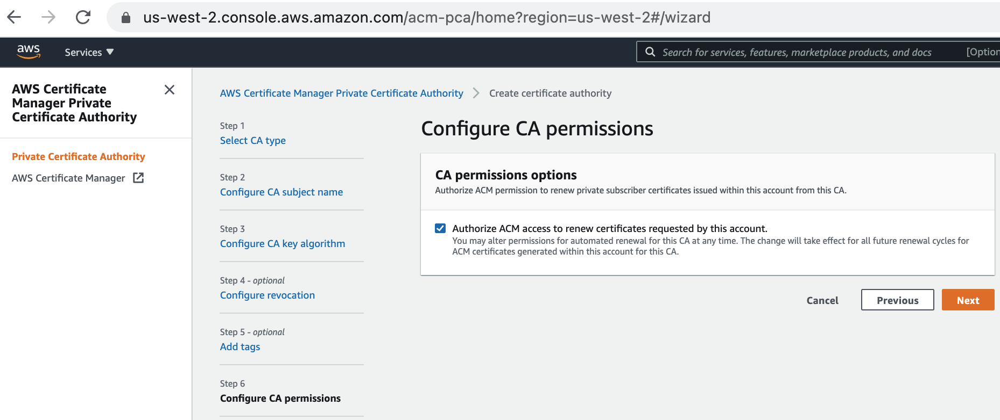
  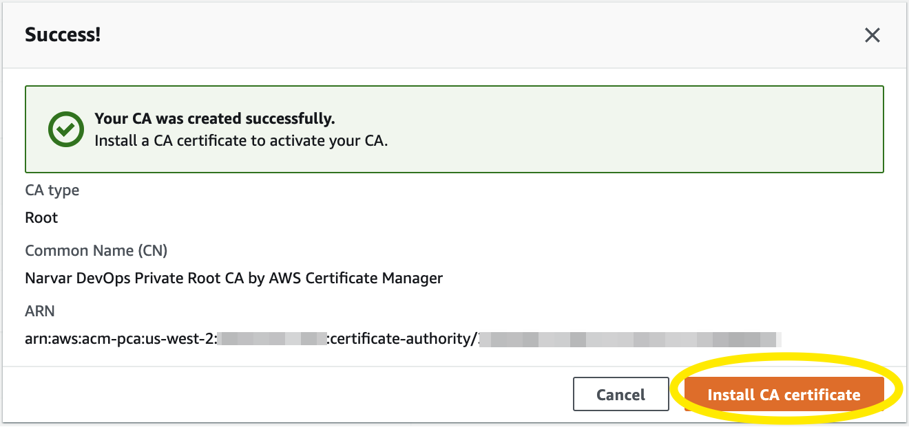

  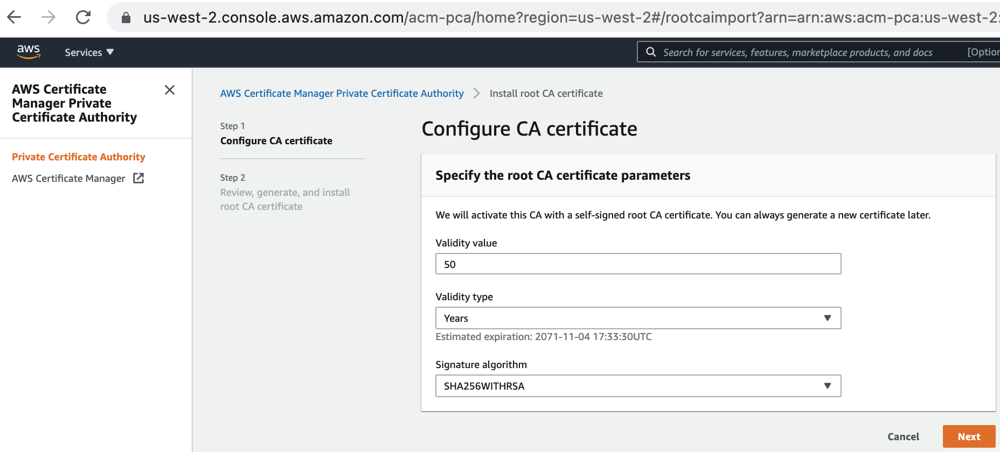
  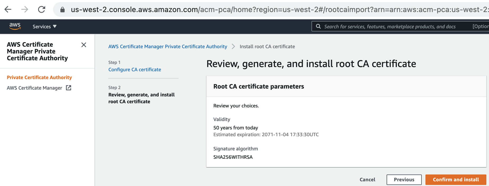
  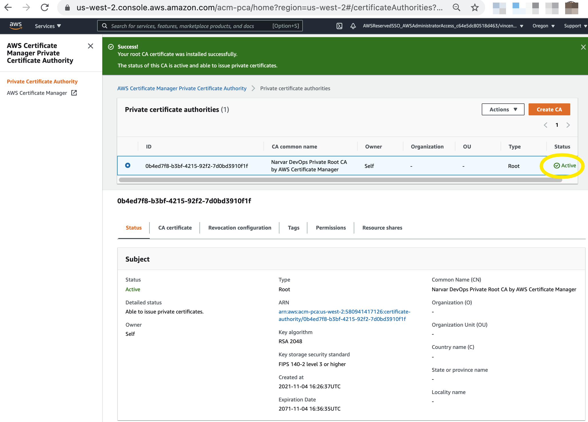

Now that the private root CA is established, we will subsequently be able to use terraform (in other repos/folders) to create certs from this CA.


# 3. Manually Increase the Quota for `Routes per Client VPN endpoint`

Our "Routes per Client VPN endpoint" exceeds the default quota of 10:
  - https://docs.aws.amazon.com/vpn/latest/clientvpn-admin/limits.html

Submit a request to increase the quota to `30`:

  

Here's a real ticket for this account:
  - https://console.aws.amazon.com/support/home#/case/?displayId=9176549151


# 4. Register a Public DNS Domain in Route 53 Registrar

* **Note:** The following can also be done in AWS Admin Console. But [cannot be done in pure terraform](https://stackoverflow.com/questions/60591937/can-i-register-a-domain-in-aws-with-terraform).

* **Caution:** Registering a public DNS domain is a minimum 1-year commitment. There's no "undo".

Create a temporary file `/tmp/register-domain.json`:
```json
{
    "DomainName": "narvarcorp.net",

    "DurationInYears": 1,
    "AutoRenew": true,

    "AdminContact": {
        "FirstName": "Narvar",
        "LastName": "Inc",
        "ContactType": "COMPANY",
        "OrganizationName": "Narvar Inc",
        "AddressLine1": "3 East Third Avenue, Suite 211",
        "City": "San Mateo",
        "State": "CA",
        "CountryCode": "US",
        "ZipCode": "94401",
        "PhoneNumber": "+1.6505859550",
        "Email": "devops+aws-networking-acct-route53@narvar.com"
    },
    "RegistrantContact": {
        "FirstName": "Narvar",
        "LastName": "Inc",
        "ContactType": "COMPANY",
        "OrganizationName": "Narvar Inc",
        "AddressLine1": "3 East Third Avenue, Suite 211",
        "City": "San Mateo",
        "State": "CA",
        "CountryCode": "US",
        "ZipCode": "94401",
        "PhoneNumber": "+1.6505859550",
        "Email": "devops+aws-networking-acct-route53@narvar.com"
    },
    "TechContact": {
        "FirstName": "Narvar",
        "LastName": "Inc",
        "ContactType": "COMPANY",
        "OrganizationName": "Narvar Inc",
        "AddressLine1": "3 East Third Avenue, Suite 211",
        "City": "San Mateo",
        "State": "CA",
        "CountryCode": "US",
        "ZipCode": "94401",
        "PhoneNumber": "+1.6505859550",
        "Email": "devops+aws-networking-acct-route53@narvar.com"
    },
    "PrivacyProtectAdminContact": true,
    "PrivacyProtectRegistrantContact": true,
    "PrivacyProtectTechContact": true
}
```

Then, do:

```console
  ## Ensure we're pointing to the 'networking' account.
$ aws sts get-caller-identity
{
    "UserId": "AR......YQ:vincent.yin@narvar.com",
    "Account": "580941417126",
    "Arn": "arn:aws:sts::580941417126:assumed-role/AWSReservedSSO_AWSAdministratorAccess_c64e5dc80518d463/vincent.yin@narvar.com"
}

  ## https://awscli.amazonaws.com/v2/documentation/api/latest/reference/route53domains/register-domain.html#examples
  ## Excerpt: "This command runs only in the us-east-1 Region."
$ aws route53domains register-domain --region us-east-1 --cli-input-json file:///tmp/register-domain.json

{
    "OperationId": "89477700-77f2-4301-a3ea-c442973472da"   <=== Command output
}
```

We will receive a series of automated emails.

The 1st email is informational (It is worded misleadingly as if it were asking us to take an action. It is not.):
  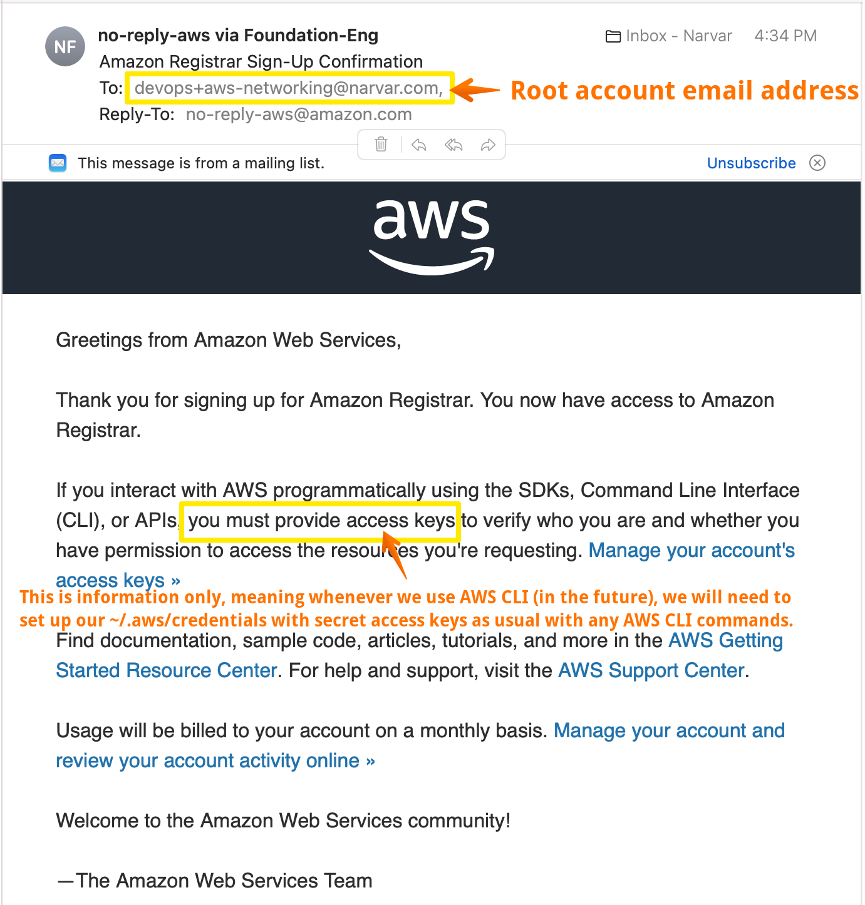

The 2nd email requires action:
  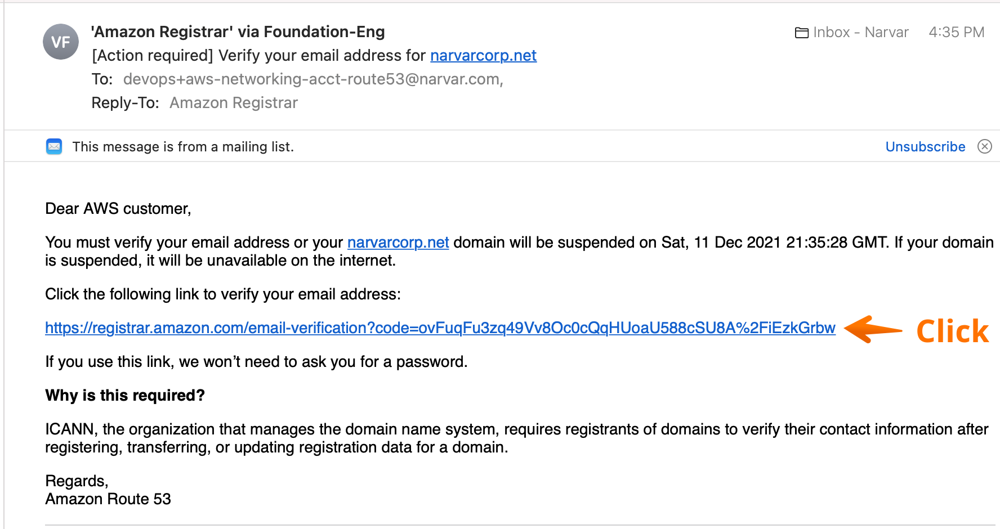

The 3rd email is informational:
  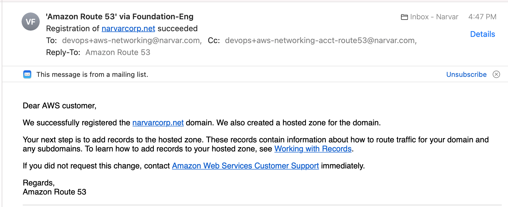

The 4th email is informational:
  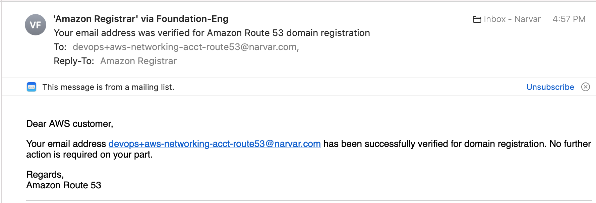

The domain now shows up in Route 53 Registrar:
  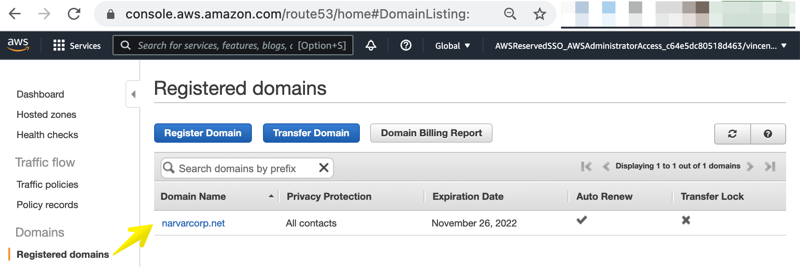

And the corresponding automatically created Hosted Zone:
  
