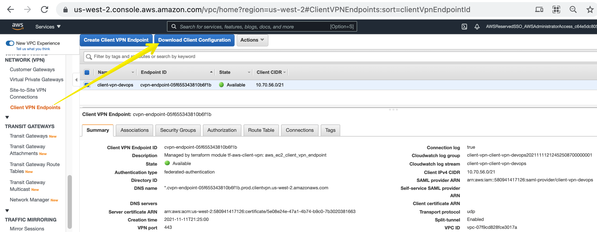
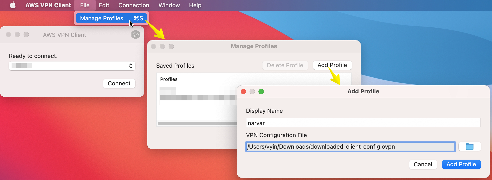
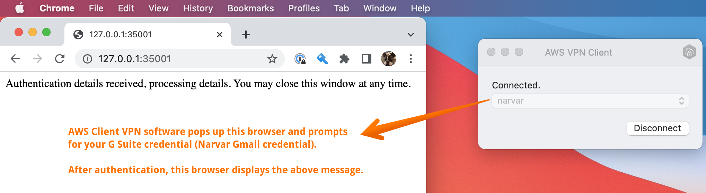
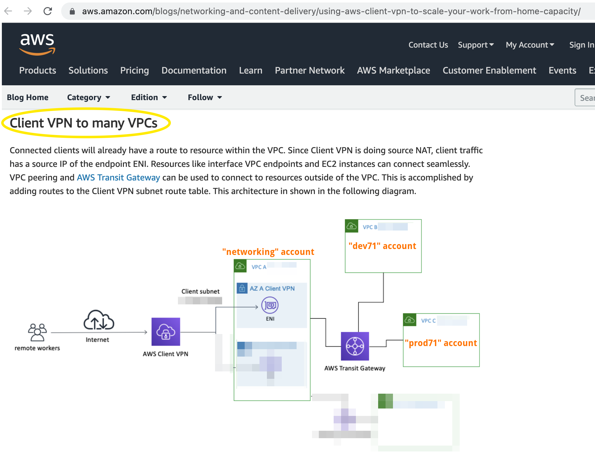
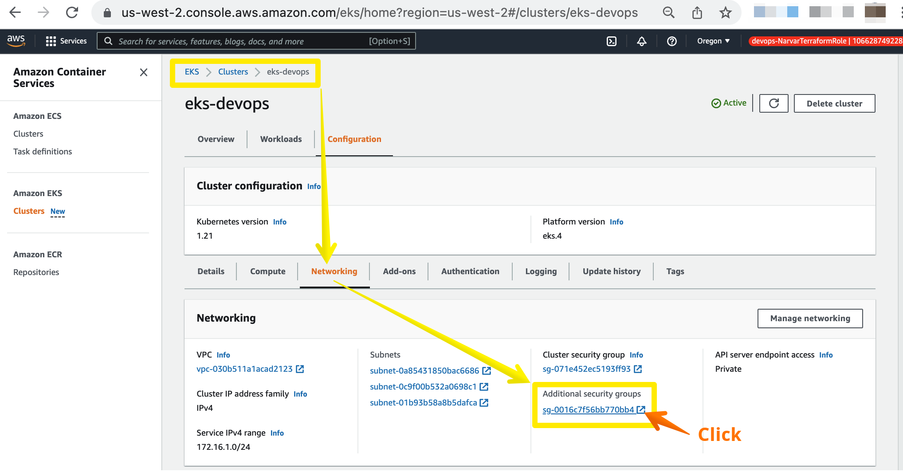
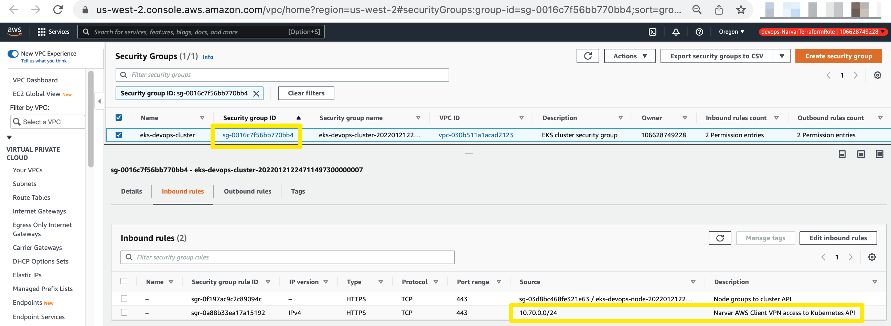

# infra <!-- omit in toc -->

<!-- The TOC and section numberings are generated by VS Code extension "Markdown All in One" -->
- [1. AWS Client VPN](#1-aws-client-vpn)
   - [1.1. Download and Set up AWS Client VPN Software on Your Laptop](#11-download-and-set-up-aws-client-vpn-software-on-your-laptop)
   - [1.2. AWS Client VPN Topolgy](#12-aws-client-vpn-topolgy)
   - [1.3. Understanding Source NAT of AWS Client VPN](#13-understanding-source-nat-of-aws-client-vpn)


# 1. AWS Client VPN
## 1.1. Download and Set up AWS Client VPN Software on Your Laptop

1. Go to [this page](https://us-west-2.console.aws.amazon.com/vpc/home?region=us-west-2#ClientVPNEndpoints:sort=clientVpnEndpointId) of the AWS Admin Console for the `networking` account. Click the button `Download Client Configuration`:
   

2. Download the client software [here](https://aws.amazon.com/vpn/client-vpn-download/).

3. Install and launch the client software. Create a profile based on the above downloaded config file:
   

4. Connect the VPN:
   

5. Test:
    ```console
    ## On laptop.
    ## View the routing table for split tunnel:
    $ netstat -r
    Routing tables

    Internet:
    Destination        Gateway            Flags        Netif Expire
    default            192.168.0.1        UGScg          en0
    10/10              10.70.56.161       UGSc         utun2
    10.64/14           10.70.56.161       UGSc         utun2
    10.68/15           10.70.56.161       UGSc         utun2
    10.70/24           10.70.56.161       UGSc         utun2
    10.70.56.160/27    10.70.56.162       UGSc         utun2
    10.70.56.162       10.70.56.162       UH           utun2
    10.70.64/18        10.70.56.161       UGSc         utun2
    10.70.128/17       10.70.56.161       UGSc         utun2
    10.71/16           10.70.56.161       UGSc         utun2
    10.72/13           10.70.56.161       UGSc         utun2
    10.80/12           10.70.56.161       UGSc         utun2
    10.96/11           10.70.56.161       UGSc         utun2
    10.128/9           10.70.56.161       UGSc         utun2
    127                localhost          UCS            lo0
    localhost          localhost          UH             lo0
    169.254            link#6             UCS            en0
    ...


    ## Pick an EC2 private IP address in a spoke VPC (e.g., an EC2 in 'dev71' account):
    $ nc -zv 10.191.16.54 22
    Connection to 10.191.16.54 port 22 [tcp/ssh] succeeded!
    ```

## 1.2. AWS Client VPN Topolgy

Our VPN topology is depicted below which is based on [this blog](https://aws.amazon.com/blogs/networking-and-content-delivery/using-aws-client-vpn-to-scale-your-work-from-home-capacity/) (section *"Client VPN to many VPCs"*).




## 1.3. Understanding Source NAT of AWS Client VPN

[AWS docs](https://docs.aws.amazon.com/vpn/latest/clientvpn-admin/what-is.html) and blogs ([here](https://aws.amazon.com/blogs/networking-and-content-delivery/using-aws-client-vpn-to-scale-your-work-from-home-capacity/) and [here](https://aws.amazon.com/blogs/networking-and-content-delivery/introducing-aws-client-vpn-to-securely-access-aws-and-on-premises-resources/)) do a poor a job of explaining what value populates the [Source IP address](https://study-ccna.com/ip-header/) header of each IP packet received by the destination when using AWS Client VPN.

It is **NOT** any of the following:
   * The output of `ifconfig | grep inet` on the laptop (when VPN is activated.) A sample output is `10.70.59.2` which belongs to `client_cidr_block` discussed in the next bullet.
   * Any address belonging to the [client_cidr_block (10.70.56.0/21)](https://github.com/narvar/terraform-aws-accounts/blob/74da7902c2d4658ad9f45a94f0ab7accb82c076d/admin/networking/20-infra/20-client-vpn.tf#L87) in the AWS Client VPN definition.

The correct answer is: It's an IP belonging to the VPC which hosts the AWS Client VPN endpoint. An AWS Client VPN endpoint typically consists of a handful of ENIs for HA. The IP is among one of the ENIs. In our case, it's an IP belonging to the [jump-vpc CIDR (10.70.0.0/24)](https://github.com/narvar/terraform-aws-accounts/blob/74da7902c2d4658ad9f45a94f0ab7accb82c076d/admin/networking/20-infra/10-vpc.tf#L11).

When an IP packet just left the laptop, its `Source IP Address` header is that shown by `ifconfig | grep inet` on the laptop (e.g., `10.70.59.2` in the example below.) And that is within the `client_cidr_block (10.70.56.0/21)`. However, when the packet reaches one of the AWS Client VPN endpoints (among typically a handful of endpoints for HA) and before it is forwarded to the next hop, AWS changes this header value to that particular endpoint's IP (e.g., `10.70.0.47` belonging in `jump-vpc` CIDR). This is called *Source NAT (SNAT)*. 

This effect can be demonstrated like this:

```console
  ## On laptop natively (not inside Docker container)
$ ip address | grep 'inet '
	...
	inet 10.70.59.2 --> 10.70.59.2/27 utun3

  ## SSH from laptop to an EC2 in dev71
$ ssh -i ~/.ssh/dev71-master.pem ec2-user@10.191.66.162

  ## Now I'm inside an EC2 in dev71
[ec2-user@ip-10-191-66-162 ~]$ sudo netstat -antp | grep ESTABLISHED | grep 22
   Proto Recv-Q Send-Q Local Address           Foreign Address         State       PID/Program name
   tcp        0     36 10.191.66.162:22        10.70.0.47:60407        ESTABLISHED 24246/sshd: ec2-use
```


   * **Sidebar:** Multiple concurrent client/laptop IP addresses are SNAT'ed to the same handful of VPN endpoint IPs (e.g., `10.70.0.47` in `jump-vpc`) but each with a different SNAT'ed source port number (e.g., port `60407` as shown in the example above). More concurrent client sessions don't result in more IPs consumed in `jump-vpc`. So, the size of `jump-vpc` CIDR is irrelevant to how many concurrent clients/laptops our AWS Client VPN deployment can support. The limit is determined by the size of `client_cidr_block (10.70.56.0/21)` with the rule of thumb given by [AWS docs](https://docs.aws.amazon.com/vpn/latest/clientvpn-admin/scaling-considerations.html): *"In general, we recommend that you specify a client CIDR range that contains twice the number of IP addresses (and therefore concurrent connections) that you plan to support on the Client VPN endpoint."*)


In order to design Security Groups or firewalls for various AWS destinations (EC2, EKS cluster control plane endpoint, etc.), we need to understand *Source NAT (SNAT)* used by AWS Client VPN.

For example, we create EKS cluster (using `eks-devops` as a concrete case) with **private** endpoint, i.e., the destination of `kubectl` traffic is a private IP address on the `devops` VPC. In order for the IP packet to be able to route from laptop to that endpoint, we need to activate AWS Client VPN. But that's not enough. The EKS cluster endpoint by default has a Security Group that won't allow just any random incoming IPs (even if they are private IPs).

   * **Question:** What additional SG rule should we add (to the EKS cluster definition) to allow such traffic?
   * **Answer:** Allow source CIDR of `jump-vpc (10.70.0.0/24)`

   
   
